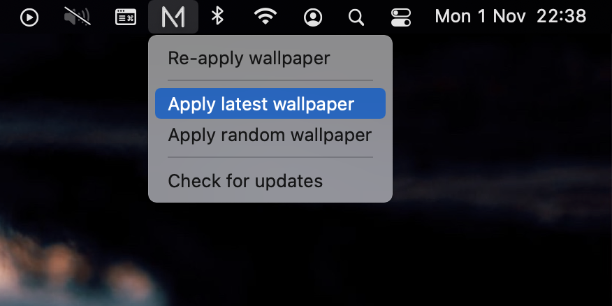

# Nettmaker Wallpaper App

An electron app that lives in your menubar with the purpose of making it easy to set a Nettmaker wallpaper.



## Installing dependencies
```
npm install
```

## Starting the app

```
npm start
```

## Creating a new build for release

```
npm run dist
```

## Generating a new app icon

```
iconutil -c icns Icon-Nettmaker-Wallpaper.iconset
```